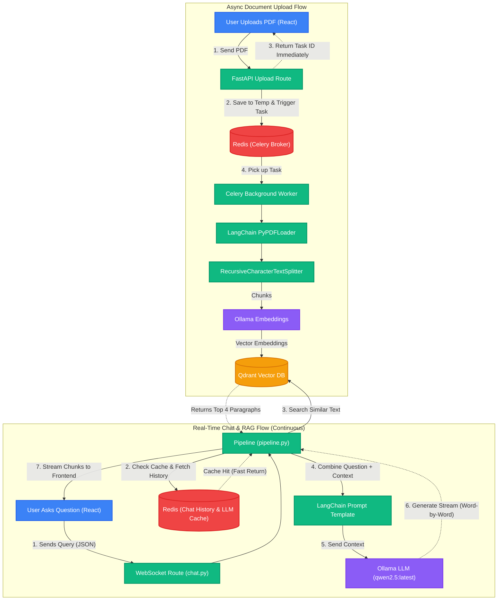

<div align="center">
  

  <h1>🧠 NexusRAG</h1>
  
  <p><strong>A highly optimized, full-stack Retrieval-Augmented Generation (RAG) engine.</strong></p>

  <p>
    
    
    
    
    
    
    
  </p>
</div>

---

## 📖 Overview

**NexusRAG** is a production-ready web application designed to allow users to interact dynamically with complex documents. By combining the conversational reasoning of **Ollama LLM (qwen2.5 / llama3)** with the ultra-fast semantic search of a **Qdrant Vector Database**, this app accurately grounds AI responses in your personal data. 

Built with performance in mind, the architecture completely avoids traditional HTTP polling in favor of **WebSocket streaming**, reducing the Time-To-First-Token (TTFT) and delivering a real-time typing experience to the user.

---

## ✨ Technical Highlights

- **⚡ WebSocket Streaming:** Implements asynchronous generators via LangChain's `.astream()` piped directly into a FastAPI WebSocket, rendering text to the React frontend instantly chunk-by-chunk.
- **🧠 History-Aware Retrieval:** Incorporates contextual compression. If a user asks a follow-up question, the backend automatically reformulates the query based on chat history before querying the vector space.
- **🗃️ Advanced Vector Management:** Global instance caching for both Qdrant Cloud clients and embedding models to eliminate cold-start overhead during multi-turn conversations.
- **📄 Multi-Format Processing:** Out-of-the-box support for chunking, parsing, and cleaning `.pdf`, `.docx`, and `.txt` files.

---

## 🏗️ System Architecture

1. **Ingestion Pipeline:** File Upload → PyPDF/Docx Parser → Recursive Character Text Splitter (500 chunk size / 50 overlap) → Ollama Embeddings (nomic-embed-text) → Qdrant Vector Store.
2. **Retrieval Pipeline:** User Query + Session ID → WebSocket Connection → Chat History Retrieval → Query Reformulation → Qdrant Similarity Search (k=4) → Context injection into Ollama LLM.

### Architecture Data Flow



---

## 🚀 Getting Started

Follow these instructions to spin up the local development environment.

### Prerequisites

* **Node.js** (v18+) and **npm**
* **Python** (v3.10+)
* API Keys for [Google Gemini](https://aistudio.google.com/) and [Qdrant Cloud](https://cloud.qdrant.io/).

### 1. Backend Setup (FastAPI)

```bash
# Navigate to the backend directory
cd backend

# Create and activate a virtual environment
python -m venv myenv
source myenv/bin/activate  # Windows: myenv\Scripts\activate

# Install dependencies
pip install fastapi uvicorn langchain langchain-google-genai langchain-qdrant qdrant-client python-dotenv pypdf docx2txt

# Configure Environment Variables
echo 'GOOGLE_API_KEY="your_api_key_here"' >> .env
echo 'QDRANT_URL="your_qdrant_url_here"' >> .env
echo 'QDRANT_API_KEY="your_qdrant_api_key"' >> .env

# Run the server
uvicorn main:app --reload
```

### 2. Frontend Setup (React/Vite)

```bash
# Navigate to the frontend directory
cd frontend/chat-app

# Install dependencies
npm install

# Start the Vite development server
npm run dev
```

Your frontend should now be running on `http://localhost:5173`!

---

## 🧠 Future Roadmap

- [x] **Redis Integration:** Swap in-memory python dictionaries for Redis to persist chat history across server restarts and scale horizontally.
- [x] **LLM Caching:** Implement LLM response caching to return instant answers for frequently asked questions, saving API costs.
- [x] **Celery Task Queue:** Offload heavy PDF embedding tasks to background workers to handle massive 1000+ page documents seamlessly.
- [ ] **User Authentication (JWT/OAuth2):** Implement secure login so multiple users can have their own private document workspaces and chat histories.
- [ ] **Multi-Modal RAG (Vision):** Upgrade the parser to extract and understand images, tables, and diagrams from PDFs using Vision models.
- [ ] **GraphRAG (Knowledge Graphs):** Integrate Neo4j to build knowledge graphs from documents for understanding complex relationships between entities.
- [ ] **Internet Search Fallback:** Automatically search the web (e.g., via DuckDuckGo API) if the answer is not found in the uploaded documents.

---

<div align="center">
  <p>Built with ❤️ by an aspiring Full Stack AI Developer.</p>
</div>
